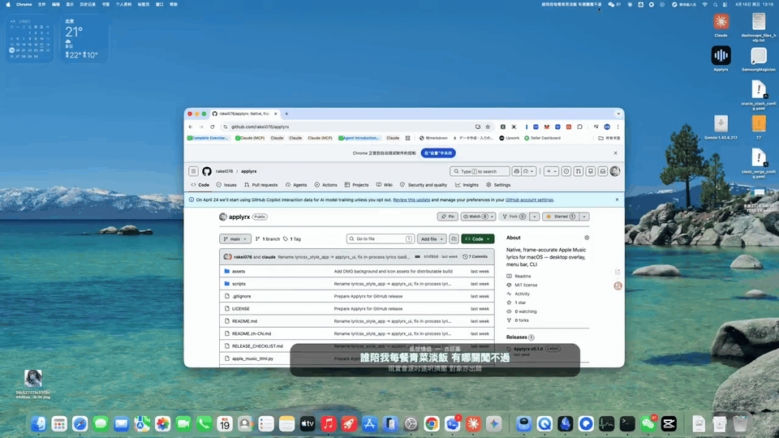

# Applyrx

**Applyrx v0.2.0 — Native Liquid Glass Lyrics Experience**

Applyrx is an unofficial macOS desktop lyrics overlay for Apple Music. It reads
timed lyrics from Apple Music's local cache and shows them in a synchronized,
click-through Liquid Glass panel with menu bar integration.

This project is based on and inspired by the MIT-licensed
[Applyrx](https://github.com/rakei076/applyrx) project. It is an independent,
unofficial third-party tool and is not affiliated with, endorsed by, or
sponsored by Apple.

## Demo



[Download the silent MP4 demo](./assets/applyrx-demo.mp4).

## Features

- macOS 26 native **Liquid Glass** lyrics panel (`NSGlassEffectView`, clear
  style) in a compact floating window.
- **Continuous upward lyric scrolling** on a single lyric track with a clipped
  viewport: the current line and the next line move together, and the styled
  current line transitions in step with the scroll instead of jumping when the
  scroll finishes.
- **Display line modes**:

  | Mode | Content |
  | --- | --- |
  | 1 line | current line |
  | 2 lines (default) | current line + next line |
  | 3 lines | previous line + current line + next line |

- Track identity card (**song title + artist**) while the song is still in its
  intro, before the first timed lyric line.
- The current line is kept through gaps between lyric lines until the next line's
  start time is reached.
- **Word-level highlighting** when Apple Music supplies word timing; automatic
  fallback to line-level lyrics when it does not.
- Follows Apple Music playback: pause and resume, seeking, large-seek
  relocation (the panel jumps straight to the target line), and track changes.
- Click-through overlay with a temporary drag mode that restores click-through.
- Global shortcuts: `Control-Option-Command-L` toggles the lyrics panel;
  `Control-Option-Command-M` temporarily enables drag mode.
- Native Settings window: current lyric size, context lyric size, context
  opacity, displayed line count (1/2/3), glass tint, remember window position,
  restore window position on launch, and Restore Defaults.
- Strict track matching: incomplete or conflicting metadata is never guessed;
  a local cache lookup is retried for a track that initially has no match.

## Requirements

- **macOS 26.0 or newer.** The lyrics panel is a native SwiftUI panel that uses
  `NSGlassEffectView`, which requires macOS 26.
- **Apple Silicon Mac.** The native lyrics panel is built for `arm64` only; Intel
  Macs are not supported by the current release.
- Apple Music.app with lyrics already present in its local cache. Opening the
  built-in lyrics view in Music may be necessary to populate local cache data.
- macOS Automation permission for reading the current Apple Music track.
- Python 3.10 or newer, but **only** when building from source. The v0.2.0
  release build was produced with Python 3.12.

## Installation

Download the release asset `Applyrx-v0.2.0-macOS.zip` from the GitHub Releases
page, unzip it, and move `Applyrx.app` to your Applications folder (or run it
from anywhere).

### First launch

The current macOS release is **ad-hoc signed only**. It is **not signed with an
Apple Developer ID** and **not notarized**, so macOS Gatekeeper may report that
it cannot verify the developer.

To open it:

1. In Finder, right-click (or Control-click) `Applyrx.app`.
2. Choose **Open**.
3. Confirm **Open** in the dialog that macOS shows.

Alternatively, allow it once under **System Settings → Privacy & Security** after
the first blocked launch ("Open Anyway"). Because the app is not notarized, it
does not carry an Apple-verified developer identity; only install it if you are
comfortable running an unsigned build you obtained from this repository.

## Build

Build a macOS app bundle from source with:

```bash
./scripts/build_app.sh
open dist/Applyrx.app
```

The build compiles `native/ApplyrxLyricsPanel.swift` for
`arm64-apple-macos26.0` using the macOS 26.5 Command Line Tools SDK (override with
the `MACOS_SDK` environment variable), then packages `dist/Applyrx.app` with
py2app. The build scripts use an installed compatible Python interpreter and do
not modify system Python; set `APPLYRX_PYTHON` to select a specific interpreter.

To produce the release archive and its checksum:

```bash
./scripts/release_macos.sh
# → Applyrx-v0.2.0-macOS.zip
# → Applyrx-v0.2.0-macOS.zip.sha256
```

`scripts/release_macos.sh` verifies the version metadata, the minimum system
version, the architecture, and that no build-machine path or user data is inside
the bundle before packaging. It never runs `git commit`, `git tag`, `git push`,
or any GitHub release step.

## Development and Testing

Run the Python test suite from the repository root:

```bash
./venv/bin/python -m unittest \
  tests.test_build_environment \
  tests.test_lyrics_panel \
  tests.test_lyrics_provider \
  tests.test_lyrics_sync \
  tests.test_music_cache_diagnostic \
  tests.test_no_fixed_home_path \
  tests.test_word_timing_diagnostic
# expected: Ran 120 tests — OK
```

`tests/` intentionally has no `__init__.py`, so `python -m unittest discover` is
not available; use the explicit module list above (or a single module, for
example `./venv/bin/python -m unittest tests.test_lyrics_sync`).

Run the native panel self-test:

```bash
./scripts/build_app.sh
./build/ApplyrxLyricsPanel --self-test
# expected: 53 self-test checks, all true
```

Check the diff for whitespace errors before committing:

```bash
git diff --check
```

## Usage

1. Start Applyrx and allow its macOS Automation request to read Music.app.
2. Play a song in Apple Music.
3. If lyrics are not found yet, open that song's built-in lyrics view in Music
   and give the local cache time to update. Applyrx retries local lookup for the
   current track.
4. Use the menu bar controls to show or hide the panel and configure its
   appearance. Choose **Settings…** for live lyric and window preferences.

Lyrics may remain unavailable if the data is not cached, a different song
version is cached, metadata is incomplete/conflicting, or strict matching cannot
establish that the cached lyrics belong to the current track.

## Keyboard Shortcuts

| Shortcut | Action |
| --- | --- |
| `Control-Option-Command-L` | Show or hide the desktop lyrics overlay |
| `Control-Option-Command-M` | Temporarily enable drag mode; click-through is restored automatically |

## Architecture

```text
Apple Music.app
      │ read current track metadata and playback position
      ▼
CurrentTrackManager ──▶ AppleMusicCacheProvider
                              │ read-only
                              ▼
                 Cache.db + fsCachedData
                              │
                 catalog/song cache response
                              │ strict identity and metadata matching
                              ▼
             syllable-lyrics TTML ──▶ TTMLParser
                                           │ timed lines / available word timing
                                           ▼
                                     LyricsEngine
                                           │
                             Python panel bridge (JSON over stdin)
                                           ▼
                       SwiftUI Liquid Glass panel + Settings
                                           │
                    single lyric track + clipped viewport + offset
```

The overlay uses Music's reported playback position as its synchronization
reference. Lyrics are sourced from cached catalog/song responses containing
Apple Music's `syllable-lyrics` extension; Applyrx does not ask a third-party
lyrics service to identify or provide lyrics.

## Apple Music data source

- Applyrx reads Apple Music's local `Cache.db` **read-only** plus the associated
  `fsCachedData` response bodies, and parses the cached `syllable-lyrics` TTML
  into timed lines and word timing.
- Applyrx reads the current track metadata and playback position from Music.app.
  It does not send playback control commands.
- Applyrx does **not** read an Apple ID password, cookies, or authentication
  tokens.
- There is **no cloud lyrics API**: lyric lookup is local-only, and no track
  information or lyric content is uploaded anywhere.
- Appearance preferences and the optional panel position are stored in the
  macOS user defaults domain `com.applyrx.desktoplyrics`. Legacy app preferences
  remain under `~/.applyrx`. Neither location stores Apple Music credentials.

## Limitations

- Apple Music does not provide ordinary third-party developers with a public,
  general-purpose interface to its complete timed lyric catalog. This project
  depends on Apple Music's local cache format, an implementation detail that can
  change with Apple Music or macOS updates.
- A lyric response must already be present in the local cache. Not every track,
  storefront, or song version will be available.
- Strict matching intentionally refuses to display lyrics when identity or
  metadata is insufficient, incomplete, or conflicting.
- Word-level highlighting and context lines depend on the timing and cached
  lyrics Apple Music supplies; without word timing Applyrx falls back to
  line-level lyrics.
- **macOS 26.0 or newer and an Apple Silicon Mac are required.** Other players
  and operating systems are not supported.
- The current release app is ad-hoc signed only: not Developer ID signed and not
  notarized.

## Troubleshooting

**The overlay says no matching lyrics.** Confirm Music.app is playing the
intended track, then open that track's built-in lyrics view so Music can
populate its local cache. Applyrx will retry. It will continue to refuse a
candidate if strict identity checks cannot establish a safe match.

**The app cannot read the current track.** Check macOS Privacy & Security →
Automation and allow Applyrx to access Music.app. Restart Applyrx after changing
the permission.

**macOS says the app cannot be verified.** The release is not notarized. Open it
with right-click → **Open**, or allow it under System Settings → Privacy &
Security.

**The panel does not appear.** Check the Applyrx menu bar item and toggle
desktop lyrics with `Control-Option-Command-L`. Confirm macOS permits the
application to run.

**The overlay cannot be moved.** Use `Control-Option-Command-M` to enter
temporary drag mode. Click-through is restored automatically after the drag
window.

## Release status

- Release asset: `Applyrx-v0.2.0-macOS.zip` with `Applyrx-v0.2.0-macOS.zip.sha256`.
- Signing: ad-hoc (`codesign -s -`), no Developer ID, `TeamIdentifier` not set.
- Notarization: not notarized.
- Distribution: GitHub Releases only. There is no App Store release.

## Roadmap

- Improve release distribution and Developer ID signing/notarization.
- Improve cache compatibility diagnostics while preserving strict matching.

## Contributing

Issues and pull requests are welcome. Please avoid including Apple Music cache
files, personal configuration, credentials, or logs containing private data in
bug reports. Changes must preserve read-only cache access, local lyric lookup,
and strict track matching.

## License

Applyrx is distributed under the MIT License. See [LICENSE](./LICENSE) for the
original copyright and license text.

## Disclaimer

Applyrx is an unofficial third-party project. Apple Music, Apple, and macOS are
trademarks of Apple Inc. This project is not affiliated with or endorsed by
Apple. Compatibility with Apple Music and macOS is not guaranteed and may
change as those products evolve.
